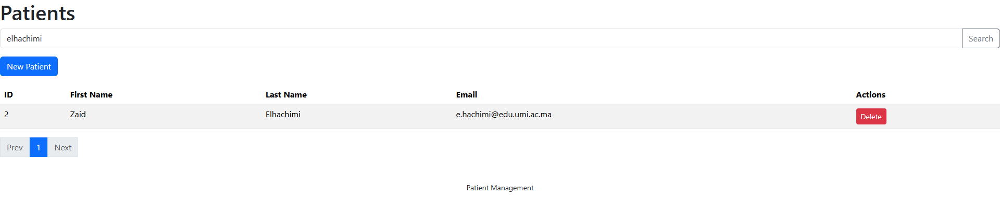
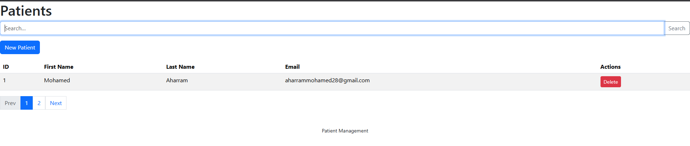
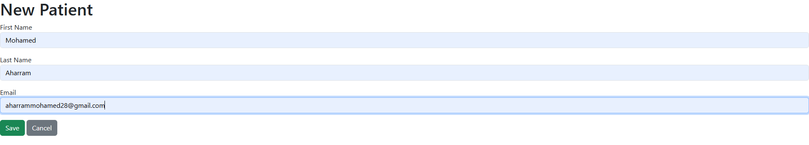
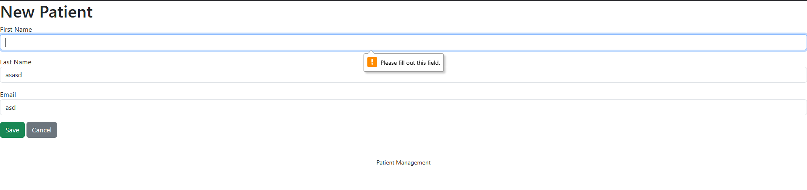
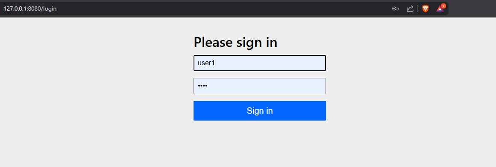
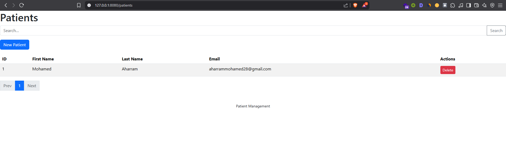

# Application de Gestion des Patients

Ce document décrit le **fonctionnement** de l’application web de gestion des patients, sans aborder l’installation ni le déploiement. Il couvre les trois parties :

1. Gestion des patients (affichage, pagination, recherche, suppression, création)
2. Template de page et validation des formulaires
3. Sécurité avec Spring Security

---

## 1. Gestion des patients

L’application permet de gérer un annuaire de patients via une interface web intuitive basée sur Spring MVC, Thymeleaf et Spring Data JPA.

### 1.1 Affichage de la liste

* La page principale affiche tous les patients sous forme de tableau.
* Chaque entrée montre l’ID, le prénom, le nom et l’email.

### 1.2 Recherche de patients

* Un champ de recherche permet de filtrer la liste par prénom ou nom (contient, insensible à la casse).
* Appuyez sur la loupe ou la touche Entrée pour lancer la recherche.



### 1.3 Pagination

* La liste est paginée pour améliorer la lisibilité.
* Contrôles « Précédent » et « Suivant » ainsi que numéros de pages pour naviguer.



### 1.4 Ajout d’un patient

* Cliquez sur le bouton **Nouveau Patient** pour accéder au formulaire de création.



### 1.5 Suppression d’un patient

* Chaque ligne de patient comporte un bouton **Supprimer**.
* Une boîte de confirmation s’affiche avant la suppression.

---

## 2. Template de page & validation des formulaires

### 2.1 Template Thymeleaf (fragments)

* Un **header** et un **footer** sont définis dans des fragments Thymeleaf réutilisables.
* Chaque page (liste, formulaire) inclut ces fragments pour l’en-tête et le pied de page.

### 2.2 Validation des formulaires

* Le formulaire utilise les annotations Bean Validation (`@NotBlank`, `@Email`).
* En cas d’erreur (champ vide, format d’email invalide), les messages sont affichés sous chaque champ.



---

## 3. Sécurité avec Spring Security

L’application est sécurisée grâce à **Spring Security**. Trois utilisateurs sont définis en mémoire :

- `user1` (mot de passe : 1234, rôle : USER)
- `user2` (mot de passe : 1234, rôle : USER)
- `admin` (mot de passe : 1234, rôles : USER, ADMIN)

### 3.1 Authentification InMemory

* À l’accès, un formulaire de connexion s’affiche :



* Après connexion, l’utilisateur accède à la liste des patients :



### 3.2 Règles d’accès

- Seuls les utilisateurs avec le rôle `ADMIN` peuvent accéder à la suppression (`/deletePatient/**`) et aux pages `/admin/**`.
- Les utilisateurs avec le rôle `USER` peuvent accéder aux pages `/user/**`.
- Toute requête nécessite une authentification.

### 3.3 Configuration (extrait)

```java
@Bean
public InMemoryUserDetailsManager inMemoryUserDetailsManager(PasswordEncoder passwordEncoder){
    String encodedPassword = passwordEncoder.encode("1234");
    return new InMemoryUserDetailsManager(
        User.withUsername("user1").password(encodedPassword).roles("USER").build(),
        User.withUsername("user2").password(encodedPassword).roles("USER").build(),
        User.withUsername("admin").password(encodedPassword).roles("USER","ADMIN").build()
    );
}
@Bean
public SecurityFilterChain securityFilterChain(HttpSecurity httpSecurity) throws Exception {
    return httpSecurity
        .formLogin(Customizer.withDefaults())
        .authorizeHttpRequests(ar->ar.requestMatchers("/deletePatient/**").hasRole("ADMIN"))
        .authorizeHttpRequests(ar->ar.requestMatchers("/admin/**").hasRole("ADMIN"))
        .authorizeHttpRequests(ar->ar.requestMatchers("/user/**").hasRole("USER"))
        .authorizeHttpRequests(ar->ar.anyRequest().authenticated())
        .build();
}
```

---

> Cette architecture vous permet de gérer facilement les patients, d’assurer une cohérence de l’interface via des templates, et de garantir l’intégrité des données grâce à la validation serveur.
